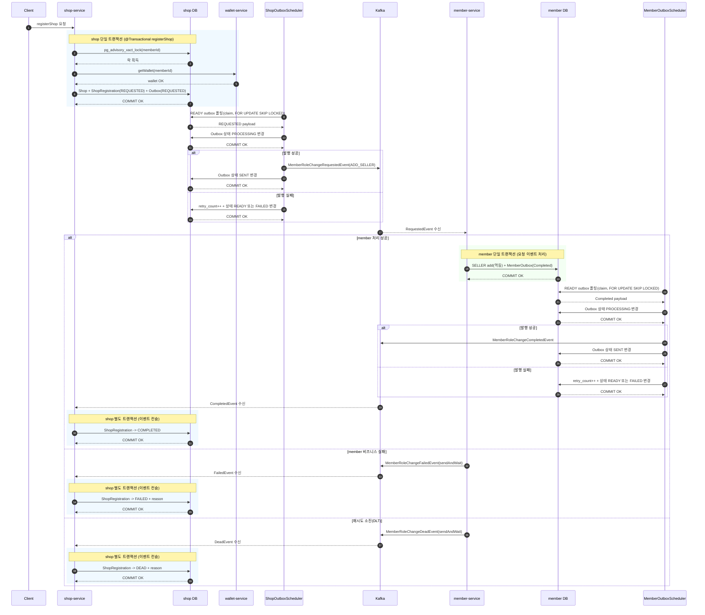
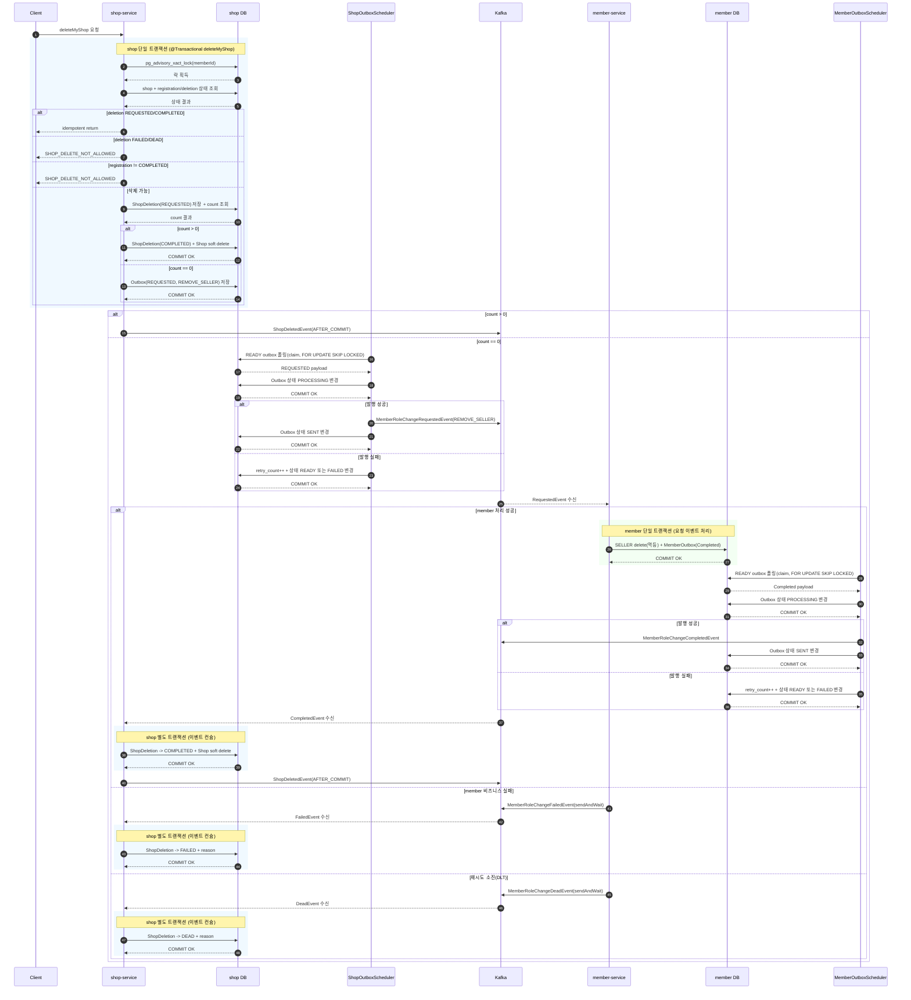

# Member Role Change Saga 시퀀스 다이어그램

## 1. 상점 등록 통합 시퀀스

```mermaid
sequenceDiagram
    autonumber
    participant C as Client
    participant S as shop-service
    participant SDB as shop DB
    participant W as wallet-service
    participant SSCH as ShopOutboxScheduler
    participant K as Kafka
    participant M as member-service
    participant MDB as member DB
    participant MSCH as MemberOutboxScheduler

    C->>S: registerShop 요청
    rect rgba(230, 245, 255, 0.6)
        Note over S,SDB: shop 단일 트랜잭션 (@Transactional registerShop)
        S->>SDB: pg_advisory_xact_lock(memberId)
        SDB-->>S: 락 획득
        S->>W: getWallet(memberId)
        W-->>S: wallet OK
        S->>SDB: Shop + ShopRegistration(REQUESTED) + Outbox(REQUESTED)
        SDB-->>S: COMMIT OK
    end

    SSCH->>SDB: READY outbox 폴링(claim, FOR UPDATE SKIP LOCKED)
    SDB-->>SSCH: REQUESTED payload
    SSCH->>SDB: Outbox 상태 PROCESSING 변경
    SDB-->>SSCH: COMMIT OK
    alt 발행 성공
        SSCH->>K: MemberRoleChangeRequestedEvent(ADD_SELLER)
        SSCH->>SDB: Outbox 상태 SENT 변경
        SDB-->>SSCH: COMMIT OK
    else 발행 실패
        SSCH->>SDB: retry_count++ + 상태 READY 또는 FAILED 변경
        SDB-->>SSCH: COMMIT OK
    end

    K-->>M: RequestedEvent 수신
    alt member 처리 성공
        rect rgba(235, 255, 235, 0.6)
            Note over M,MDB: member 단일 트랜잭션 (요청 이벤트 처리)
            M->>MDB: SELLER add(멱등) + MemberOutbox(Completed)
            MDB-->>M: COMMIT OK
        end
        MSCH->>MDB: READY outbox 폴링(claim, FOR UPDATE SKIP LOCKED)
        MDB-->>MSCH: Completed payload
        MSCH->>MDB: Outbox 상태 PROCESSING 변경
        MDB-->>MSCH: COMMIT OK
        alt 발행 성공
            MSCH->>K: MemberRoleChangeCompletedEvent
            MSCH->>MDB: Outbox 상태 SENT 변경
            MDB-->>MSCH: COMMIT OK
        else 발행 실패
            MSCH->>MDB: retry_count++ + 상태 READY 또는 FAILED 변경
            MDB-->>MSCH: COMMIT OK
        end
        K-->>S: CompletedEvent 수신
        rect rgba(230, 245, 255, 0.6)
            Note over S,SDB: shop 별도 트랜잭션 (이벤트 컨슘)
            S->>SDB: ShopRegistration -> COMPLETED
            SDB-->>S: COMMIT OK
        end
    else member 비즈니스 실패
        M->>K: MemberRoleChangeFailedEvent(sendAndWait)
        K-->>S: FailedEvent 수신
        rect rgba(230, 245, 255, 0.6)
            Note over S,SDB: shop 별도 트랜잭션 (이벤트 컨슘)
            S->>SDB: ShopRegistration -> FAILED + reason
            SDB-->>S: COMMIT OK
        end
    else 재시도 소진(DLT)
        M->>K: MemberRoleChangeDeadEvent(sendAndWait)
        K-->>S: DeadEvent 수신
        rect rgba(230, 245, 255, 0.6)
            Note over S,SDB: shop 별도 트랜잭션 (이벤트 컨슘)
            S->>SDB: ShopRegistration -> DEAD + reason
            SDB-->>S: COMMIT OK
        end
    end
```

## 2. 상점 삭제 통합 시퀀스

```mermaid
sequenceDiagram
    autonumber
    participant C as Client
    participant S as shop-service
    participant SDB as shop DB
    participant SSCH as ShopOutboxScheduler
    participant K as Kafka
    participant M as member-service
    participant MDB as member DB
    participant MSCH as MemberOutboxScheduler

    C->>S: deleteMyShop 요청
    rect rgba(230, 245, 255, 0.6)
        Note over S,SDB: shop 단일 트랜잭션 (@Transactional deleteMyShop)
        S->>SDB: pg_advisory_xact_lock(memberId)
        SDB-->>S: 락 획득
        S->>SDB: shop + registration/deletion 상태 조회
        SDB-->>S: 상태 결과

        alt deletion REQUESTED/COMPLETED
            S-->>C: idempotent return
        else deletion FAILED/DEAD
            S-->>C: SHOP_DELETE_NOT_ALLOWED
        else registration != COMPLETED
            S-->>C: SHOP_DELETE_NOT_ALLOWED
        else 삭제 가능
            S->>SDB: ShopDeletion(REQUESTED) 저장 + count 조회
            SDB-->>S: count 결과
            alt count > 0
                S->>SDB: ShopDeletion(COMPLETED) + Shop soft delete
                SDB-->>S: COMMIT OK
            else count == 0
                S->>SDB: Outbox(REQUESTED, REMOVE_SELLER) 저장
                SDB-->>S: COMMIT OK
            end
        end
    end

    alt count > 0
        S->>K: ShopDeletedEvent(AFTER_COMMIT)
    else count == 0
        SSCH->>SDB: READY outbox 폴링(claim, FOR UPDATE SKIP LOCKED)
        SDB-->>SSCH: REQUESTED payload
        SSCH->>SDB: Outbox 상태 PROCESSING 변경
        SDB-->>SSCH: COMMIT OK
        alt 발행 성공
            SSCH->>K: MemberRoleChangeRequestedEvent(REMOVE_SELLER)
            SSCH->>SDB: Outbox 상태 SENT 변경
            SDB-->>SSCH: COMMIT OK
        else 발행 실패
            SSCH->>SDB: retry_count++ + 상태 READY 또는 FAILED 변경
            SDB-->>SSCH: COMMIT OK
        end

        K-->>M: RequestedEvent 수신
        alt member 처리 성공
            rect rgba(235, 255, 235, 0.6)
                Note over M,MDB: member 단일 트랜잭션 (요청 이벤트 처리)
                M->>MDB: SELLER delete(멱등) + MemberOutbox(Completed)
                MDB-->>M: COMMIT OK
            end
            MSCH->>MDB: READY outbox 폴링(claim, FOR UPDATE SKIP LOCKED)
            MDB-->>MSCH: Completed payload
            MSCH->>MDB: Outbox 상태 PROCESSING 변경
            MDB-->>MSCH: COMMIT OK
            alt 발행 성공
                MSCH->>K: MemberRoleChangeCompletedEvent
                MSCH->>MDB: Outbox 상태 SENT 변경
                MDB-->>MSCH: COMMIT OK
            else 발행 실패
                MSCH->>MDB: retry_count++ + 상태 READY 또는 FAILED 변경
                MDB-->>MSCH: COMMIT OK
            end
            K-->>S: CompletedEvent 수신
            rect rgba(230, 245, 255, 0.6)
                Note over S,SDB: shop 별도 트랜잭션 (이벤트 컨슘)
                S->>SDB: ShopDeletion -> COMPLETED + Shop soft delete
                SDB-->>S: COMMIT OK
            end
            S->>K: ShopDeletedEvent(AFTER_COMMIT)
        else member 비즈니스 실패
            M->>K: MemberRoleChangeFailedEvent(sendAndWait)
            K-->>S: FailedEvent 수신
            rect rgba(230, 245, 255, 0.6)
                Note over S,SDB: shop 별도 트랜잭션 (이벤트 컨슘)
                S->>SDB: ShopDeletion -> FAILED + reason
                SDB-->>S: COMMIT OK
            end
        else 재시도 소진(DLT)
            M->>K: MemberRoleChangeDeadEvent(sendAndWait)
            K-->>S: DeadEvent 수신
            rect rgba(230, 245, 255, 0.6)
                Note over S,SDB: shop 별도 트랜잭션 (이벤트 컨슘)
                S->>SDB: ShopDeletion -> DEAD + reason
                SDB-->>S: COMMIT OK
            end
        end
    end
```
