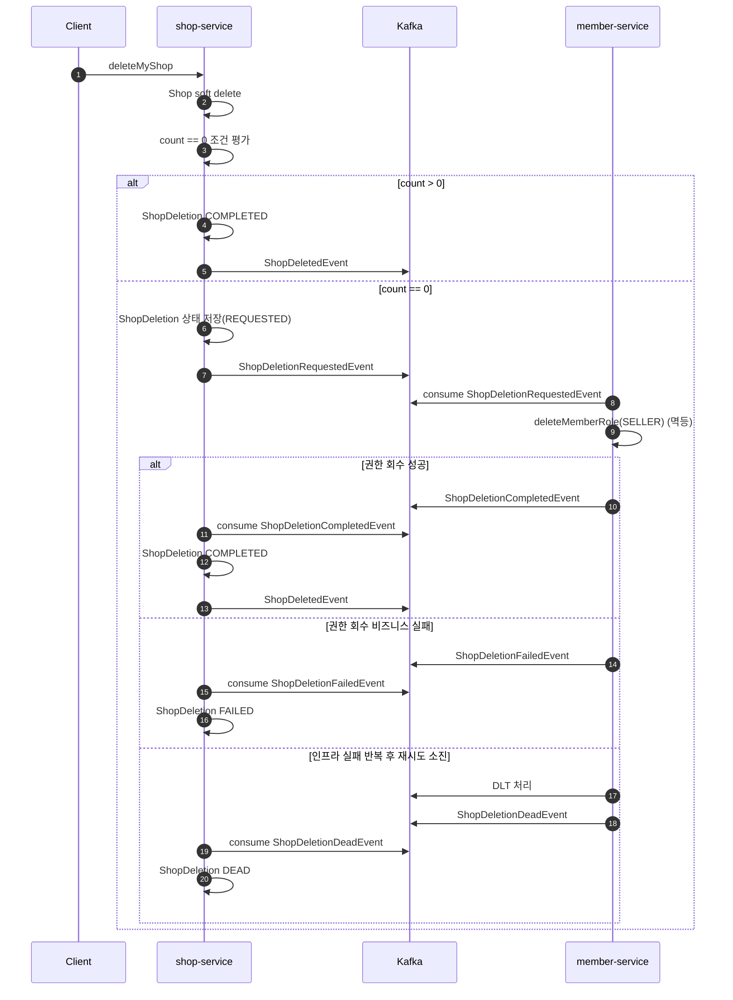

# Shop 삭제 + SELLER 권한 회수 Saga 설계

**Shop 삭제와 SELLER 권한 회수를 하나의 사용자 행위로 보장하기 위한 Saga 설계**를 정리한다.

---

## 0. 문제 배경

가게 삭제는 사용자 관점에서는 하나의 행위지만, 시스템적으로는 여러 독립 작업의 조합이다.

1. **shop-service**
   - Shop soft delete (`deletedAt` 설정)
   - `ShopDeletedEvent` 발행 (catalog/order 후속 정리)
2. **member-service**
   - 마지막 상점 삭제 시 SELLER 권한 회수 (`deleteMemberRole`)

제약 사항:

- 서로 다른 서비스
- 단일 트랜잭션으로 원자성 보장 불가
- 외부 호출 실패/타임아웃 시 처리 완료 여부 불명확

목표:

- 사용자에게는 “가게 삭제 + SELLER 권한 회수”를 하나의 완료된 결과로 제공
- 시스템은 **최종 일관성(Eventual Consistency)** 기반으로 권한/후속 처리 정합성 유지

---

## 1. 1차 설계: 단순 동기 처리 + 로컬 트랜잭션

### 설계 방향

- 가장 직관적인 방식으로 문제를 먼저 해결

### 구조

- 하나의 트랜잭션에서:
  - shop 조회 + soft delete
  - 남은 shop 수 확인
  - 마지막 shop이면 `member-service.deleteMemberRole(SELLER)` 동기 호출
  - `ShopDeletedEvent` 발행

### 한계

- 외부 호출 성공/실패를 확정할 수 없음(타임아웃)
- 외부 호출 실패 시 로컬 트랜잭션 전체가 롤백될 수 있음
- 트랜잭션이 길어지고 서비스 간 결합도가 높아짐
- 권한 회수와 이벤트 발행이 동일 트랜잭션에 묶여 장애 시 후속 처리가 지연될 수 있음

---

## 2. 2차 설계: 재시도 도입

### 설계 방향

- OpenFeign + Retry 적용
- 일시 장애에 대한 복원력 확보

### 한계

- 재시도 중에도 성공/실패 여부를 확정하기 어려움
- 재시도는 요청 시점에만 유효해 지연 복구에 한계가 있음
- 서버 재시작/장애 시 재시도 상태 추적이 어려움

---

## 3. 3차 설계: 조건부 권한 회수

### 배경

현재 구현은 `shopCount == 0`일 때만 SELLER 권한 회수를 시도한다.

- 마지막 상점 삭제가 아닐 경우 권한 회수 불필요
- 불필요한 외부 호출 감소
- 실패/타임아웃 노출 면적 축소

### 한계

- “필요한 경우”에 대해 여전히 동기 호출/강결합
- `count == 0` 시점 조건평가는 동시 삭제/등록 교차 상황에서 정합성이 깨질 수 있음

---

## 4. 4차 설계: 이벤트 방식 Orchestrated Saga

### 1. 설계 방향

- **Orchestrated Saga**
- `shop-service`가 삭제를 우선 커밋하고, 권한 회수는 비동기 오케스트레이션
- `ShopDeletedEvent`는 삭제 상태가 `COMPLETED`로 전이된 뒤 발행

### 2. 설계 변경

#### A. 상태 분리

- ShopDeletion 상태: `REQUESTED -> COMPLETED / FAILED / DEAD`

#### B. 이벤트 정의

- `ShopDeletionRequestedEvent`
- `ShopDeletionCompletedEvent`
- `ShopDeletionFailedEvent`
- `ShopDeletionDeadEvent`

참고:

- `ShopDeletedEvent(shopId)`는 catalog/order 후속 처리 이벤트로 유지

#### C. 오케스트레이션 규칙

- 마지막 상점 삭제가 아니면 `COMPLETED`로 즉시 종료
- 마지막 상점 삭제면 `REQUESTED` 상태에서 `ShopDeletionRequestedEvent` 발행 후 결과 이벤트 대기
- `member-service` 결과 이벤트로 최종 상태 전이
- `ShopDeletedEvent`는 `ShopDeletion` 상태 `COMPLETED` 전이 이후 발행

---

### 3. 상세 흐름

#### 성공 흐름

1. Client -> `shop-service`: `deleteMyShop`
2. `shop-service`: Shop soft delete
3. `shop-service`: 상점 수 조건 평가(`count == 0`)
4. (마지막 상점이 아닌 경우) `shop-service`: `ShopDeletion` 상태 `COMPLETED` 전이 + `ShopDeletedEvent` 발행
5. (마지막 상점인 경우) `shop-service`: `ShopDeletion` 생성(`REQUESTED`) + `ShopDeletionRequestedEvent` 발행
6. `member-service`: SELLER 권한 회수(이미 SELLER가 없다면 no-op)
7. `member-service` -> Kafka: `ShopDeletionCompletedEvent`
8. `shop-service`: `ShopDeletion` 상태 `COMPLETED` 전이 + `ShopDeletedEvent` 발행

#### 실패 흐름

1. 1~5 동일
2. `member-service`: 권한 회수가 비즈니스 규칙으로 실패
3. `member-service` -> Kafka: `ShopDeletionFailedEvent`
4. `shop-service`: `ShopDeletion` 상태 `FAILED` 전이

#### 최종 실패 흐름 (DEAD)

1. 인프라 장애로 처리/발행 실패가 반복됨
2. `member-service`: Kafka 재시도 소진 후 DLT 격리
3. `member-service` -> Kafka: `ShopDeletionDeadEvent`
4. `shop-service`: `ShopDeletion` 상태 `DEAD` 전이

---

### 4. 시퀀스 다이어그램

---

## 5. Retry + DLT + DEAD 구현

상황:

- 삭제 Saga도 실패 원인이 비즈니스/인프라로 섞여 있었다.
- 동일 정책으로 처리하면 재시도 기준과 상태 전이 의미가 흐려졌다.

판단:

- 실패를 의미 기준으로 분리해야 재시도 정책과 상태 확정을 동시에 지킬 수 있다.
- DLT를 외부 계약으로 노출하면 서비스 경계가 약해진다.

적용:

- 비즈니스 실패는 `FAILED`로 즉시 확정했다.
- 인프라 실패는 Kafka 재시도 + DLT 경로로 위임했다.
- DLT 메시지는 내부에서 `DEAD` 도메인 이벤트로 변환해 shop-service 상태 전이에 반영했다.
- 이 패턴을 삭제 흐름뿐 아니라 Saga consumer 공통 정책으로 적용했다.

결과:

- 실패 처리 기준이 단순해지고 일관성이 높아졌다.
- 서비스 간 계약은 `FAILED/DEAD` 이벤트 중심으로 유지됐다.
- 운영 복구 경로는 내부(DLT), 최종 상태는 도메인 이벤트로 확정하는 구조가 정착됐다.

---

## 6. 추가 고려 사항

- Outbox 도입
  - 현재는 트랜잭션 커밋과 이벤트 발행이 분리되어 있어 **발행 실패 시 누락 위험**이 존재
  - Outbox를 적용하면 **DB 커밋과 이벤트 기록을 원자적으로 보장**할 수 있음
  - 실패 시 재발행이 가능해 **이벤트 유실을 방지**할 수 있음
- 수동 재처리 운영 절차
  - 현재는 재시도 소진 시 DLT 적재까지 자동 처리
  - DLT 적재 건은 운영 알림 후 수동 재처리(재발행/보정) 기준을 별도로 유지
  - 반복 실패 건은 원인 분류(데이터/코드/인프라) 후 재처리 여부를 결정
- 멱등성
  - `member-service.deleteMemberRole` 멱등 보장
  - 이벤트 중복 소비 시 상태 전이가 안전해야 함
- 운영 관측성
  - `shopId`, `memberId`, `eventId`, `status` 기반 추적
  - `REQUESTED`/`FAILED` 장기 체류 알림
- 동시성 개선 필요
  - 현재 `count == 0` 삭제 시점 조건평가는 등록/삭제 동시성에서 정합성 깨질 수 있음
  - 동시성 발생 예시: 상점 2개를 동시에 삭제하면 각 트랜잭션이 `count > 0`으로 판단해 SELLER 권한 회수를 모두 건너뛸 수 있음
  - 동시성 발생 예시: 마지막 상점 삭제와 신규 상점 등록이 교차되면 SELLER 권한이 잘못 제거될 수 있음
  - 개선 방식: member 단위 직렬화 또는 비동기 재평가 방식으로 개선 필요
- 실패 정책
  - `FAILED`는 즉시 사용자 오류로 노출하지 않고 운영 처리 대상
