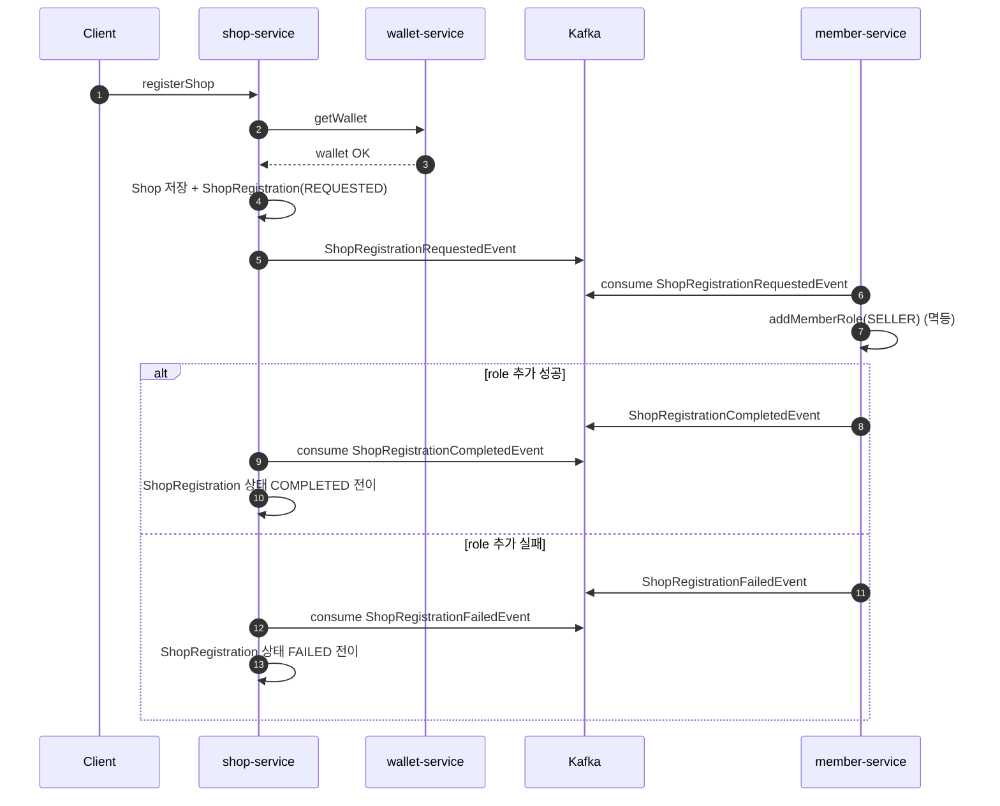

# Shop 등록 + SELLER 권한 부여 Saga 설계

**Shop 등록과 SELLER 권한 부여를 하나의 사용자 행위로 보장하기 위한 Saga 설계**를 정리한다.

---

## 0. 문제 배경

가게 등록은 사용자 관점에서는 하나의 행위지만, 시스템적으로는 여러 독립 작업의 조합이다.

1. **shop-service**
   - Shop 생성
2. **member-service**
   - SELLER 권한 부여 (`addMemberRole`)

제약 사항:

- 서로 다른 서비스
- 단일 트랜잭션으로 원자성 보장 불가
- 외부 호출 실패/타임아웃 시 처리 완료 여부 불명확

목표:

- 사용자에게는 “가게 등록 + SELLER 권한 부여”를 하나의 완료된 결과로 제공
- 시스템은 **최종 일관성(Eventual Consistency)** 기반으로 서비스 간 정합성 유지

---

## 1. 1차 설계: 단순 동기 처리 + 즉시 보상

### 설계 방향

- 가장 직관적인 방식으로 문제를 먼저 해결

### 구조

- 하나의 트랜잭션에서:
   - Shop 저장
   - 외부 서비스(member-service) 동기 호출
- 외부 호출 실패 시:
   - 보상(deleteRole) 시도
   - 예외 발생 → 로컬 트랜잭션 롤백

```java
    @Transactional
    public void registerShop(UUID memberId, ShopRegisterCommand command) {
        checkWalletExists(memberId);

        Shop shop = Shop.create(memberId, command);
        shopRepository.save(shop);

        try {
            memberClient.addMemberRole(memberId, new RoleModifyRequest(ROLE_SELLER));
        } catch (Exception e) {
            try {
                memberClient.deleteMemberRole(memberId, new RoleModifyRequest(ROLE_SELLER));
            } catch (Exception ignore) {
                // 보상 실패는 감수 (로그만 기록)
            }
            throw new ShopException(ShopErrorCode.ROLE_UPDATE_FAILED);
        }
    }
```

### 한계

- 외부 호출 성공/실패를 확정할 수 없음(타임아웃)
- 보상 또한 외부 호출이므로 실패 가능
- 트랜잭션이 길어짐
- 장애 발생 시 “어디까지 처리됐는지” 알 수 없음

---

## 2. 2차 설계: 재시도 도입

### 설계 방향

- OpenFeign + Retry 적용
- 일시 장애에 대한 복원력 확보

### 한계

- 재시도 중에도 성공/실패 여부를 확정하기 어려움
- 재시도는 요청 시점에만 유효해 지연 복구에 한계가 있음
- 서버 재시작/장애 시 재시도 상태 추적이 어려움

---

## 3. 3차 설계: 멱등 SELLER 권한 부여 도입

### 배경

기존 설계에서는 `registerShop()` 요청이 올 때마다 **항상** `member-service.addRole(memberId, SELLER)`를 호출한다.  
하지만 다음 비효율이 발생

- 이미 SELLER인 사용자도 매번 외부 호출이 발생한다.
- 실패/타임아웃 시 “성공 여부를 확정할 수 없는 상태”를 불필요하게 자주 만든다.
- 결과적으로 분산 트랜잭션(Saga/Outbox) 진입 빈도가 증가해 복잡도와 비용이 커진다.

따라서 권한 부여는 호출 자체를 조건 분기하기보다, **멱등하게 수행**하도록 설계를 조정한다.

### 한계

- 멱등 처리로 중복 호출 부담은 줄지만, 권한 부여는 여전히 외부 호출 경로에 의존함
- 타임아웃/부분 실패 시 처리 완료 여부를 확정하기 어려움
- “필요한 경우”에 대한 호출 최적화만으로는 서비스 간 강결합을 해소하지 못함

---

## 4. 4차 설계: 이벤트 방식 Orchestrated Saga

### 1. 설계 방향

- **Orchestrated Saga**
- `shop-service`는 등록을 우선 커밋하고 권한 등록은 비동기 오케스트레이션
- `member-service`가 멱등하게 역할 부여 수행(이미 SELLER면 no-op)
- 성공/실패 이벤트에 따라 `shop-service`가 상태 전이

---

### 2. 설계 변경

#### A. 상태 분리
- ShopRegistration 상태: `REQUESTED → COMPLETED / FAILED`

#### B. 이벤트 정의
- `ShopRegistrationRequestedEvent`
- `ShopRegistrationCompletedEvent`
- `ShopRegistrationFailedEvent`

#### C. 멱등 역할 부여 위임
- `member-service`가 멱등하게 SELLER 권한 부여 처리
- `shop-service`는 **항상 이벤트 발행**

---

### 3. 상세 흐름

#### 성공 흐름
1. Client → `shop-service` : 1registerShop1
2. `shop-service` → `wallet-service` : Wallet 확인
3. `shop-service` : Shop 저장 + ShopRegistration(`REQUESTED`)
4. `shop-service` → Kafka : `ShopRegistrationRequestedEvent`
5. `member-service` : SELLER 권한 부여 시도(이미 SELLER면 no-op)
6. 역할 부여 완료
7. `member-service` → Kafka : `ShopRegistrationCompletedEvent`
8. `shop-service` : ShopRegistration 상태 `COMPLETED` 전이

#### 실패 흐름
1. 1~5 동일
2. 역할 추가 실패
3. `member-service` → Kafka : `ShopRegistrationFailedEvent`
4. `shop-service` : ShopRegistration 상태 `FAILED` 전이

---

### 4. 시퀀스 다이어그램



---

### 5. 추가 고려 사항

- 이벤트 재시도 및 DLQ 구성
- Outbox 도입
  - 현재는 트랜잭션 커밋과 이벤트 발행이 분리되어 있어 **발행 실패 시 누락 위험**이 존재
  - Outbox를 적용하면 **DB 커밋과 이벤트 기록을 원자적으로 보장**할 수 있음
  - 실패 시 재발행이 가능해 **이벤트 유실을 방지**할 수 있음
- 운영 관측성
  - `shopId`, `memberId`, `eventId`, `status` 기반 추적
  - `REQUESTED`/`FAILED` 장기 체류 알림
