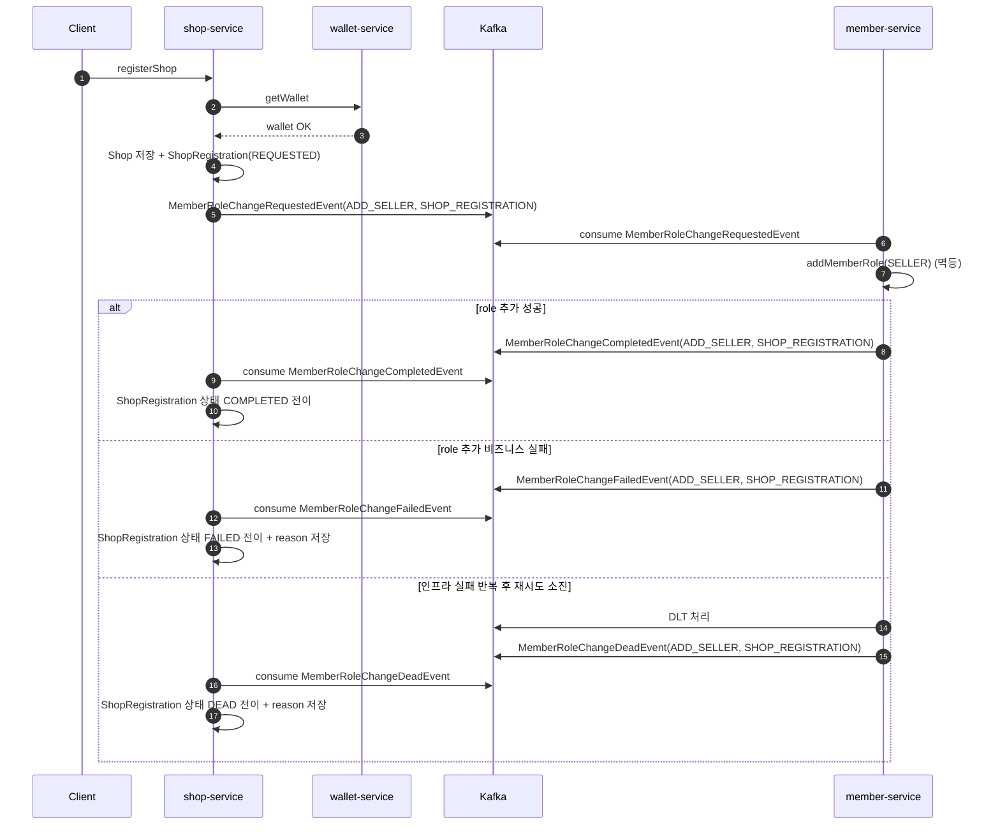

# Shop 등록 + SELLER 권한 부여 Saga 설계

**Shop 등록과 SELLER 권한 부여를 하나의 사용자 행위로 보장하기 위한 Saga 설계**를 정리한다.

---

## 0. 문제 배경

가게 등록은 사용자 관점에서는 하나의 행위지만, 시스템적으로는 여러 독립 작업의 조합이다.

1. **shop-service**
   - Shop 생성
2. **member-service**
   - SELLER 권한 부여 (`addMemberRole`)

제약 사항:

- 서로 다른 서비스
- 단일 트랜잭션으로 원자성 보장 불가
- 외부 호출 실패/타임아웃 시 처리 완료 여부 불명확

목표:

- 사용자에게는 “가게 등록 + SELLER 권한 부여”를 하나의 완료된 결과로 제공
- 시스템은 **최종 일관성(Eventual Consistency)** 기반으로 서비스 간 정합성 유지

---

## 1. 1차 설계: 단순 동기 처리 + 즉시 보상

### 설계 방향

- 가장 직관적인 방식으로 문제를 먼저 해결

### 구조

- 하나의 트랜잭션에서:
   - Shop 저장
   - 외부 서비스(member-service) 동기 호출
- 외부 호출 실패 시:
   - 보상(deleteRole) 시도
   - 예외 발생 → 로컬 트랜잭션 롤백

```java
    @Transactional
    public void registerShop(UUID memberId, ShopRegisterCommand command) {
        checkWalletExists(memberId);

        Shop shop = Shop.create(memberId, command);
        shopRepository.save(shop);

        try {
            memberClient.addMemberRole(memberId, new RoleModifyRequest(ROLE_SELLER));
        } catch (Exception e) {
            try {
                memberClient.deleteMemberRole(memberId, new RoleModifyRequest(ROLE_SELLER));
            } catch (Exception ignore) {
                // 보상 실패는 감수 (로그만 기록)
            }
            throw new ShopException(ShopErrorCode.ROLE_UPDATE_FAILED);
        }
    }
```

### 한계

- 외부 호출 성공/실패를 확정할 수 없음(타임아웃)
- 보상 또한 외부 호출이므로 실패 가능
- 트랜잭션이 길어짐
- 장애 발생 시 “어디까지 처리됐는지” 알 수 없음

---

## 2. 2차 설계: 재시도 도입

### 설계 방향

- OpenFeign + Retry 적용
- 일시 장애에 대한 복원력 확보

### 한계

- 재시도 중에도 성공/실패 여부를 확정하기 어려움
- 재시도는 요청 시점에만 유효해 지연 복구에 한계가 있음
- 서버 재시작/장애 시 재시도 상태 추적이 어려움

---

## 3. 3차 설계: 멱등 SELLER 권한 부여 도입

### 배경

기존 설계에서는 `registerShop()` 요청이 올 때마다 **항상** `member-service.addRole(memberId, SELLER)`를 호출한다.  
하지만 다음 비효율이 발생

- 이미 SELLER인 사용자도 매번 외부 호출이 발생한다.
- 실패/타임아웃 시 “성공 여부를 확정할 수 없는 상태”를 불필요하게 자주 만든다.
- 결과적으로 분산 트랜잭션(Saga/Outbox) 진입 빈도가 증가해 복잡도와 비용이 커진다.

따라서 권한 부여는 호출 자체를 조건 분기하기보다, **멱등하게 수행**하도록 설계를 조정한다.

### 한계

- 멱등 처리로 중복 호출 부담은 줄지만, 권한 부여는 여전히 외부 호출 경로에 의존함
- 타임아웃/부분 실패 시 처리 완료 여부를 확정하기 어려움
- “필요한 경우”에 대한 호출 최적화만으로는 서비스 간 강결합을 해소하지 못함

---

## 4. 4차 설계: 이벤트 방식 Orchestrated Saga

### 1. 설계 방향

- **Orchestrated Saga**
- `shop-service`는 등록을 우선 커밋하고 권한 등록은 비동기 오케스트레이션
- `member-service`가 멱등하게 역할 부여 수행(이미 SELLER면 no-op)
- 성공/실패 이벤트에 따라 `shop-service`가 상태 전이
- 권한 변경 관련 이벤트는 토픽을 분리하되, 각 이벤트 타입에서 `memberId` key 기반 순서를 유지

---

### 2. 설계 변경

#### A. 상태 분리
- ShopRegistration 상태: `REQUESTED → COMPLETED / FAILED / DEAD`

#### B. 이벤트 정의
- `MemberRoleChangeRequestedEvent`
- `MemberRoleChangeCompletedEvent`
- `MemberRoleChangeFailedEvent`
- `MemberRoleChangeDeadEvent`

공통 페이로드:

- `memberId`, `shopId`, `action(ADD_SELLER | REMOVE_SELLER)`, `sagaType(SHOP_REGISTRATION | SHOP_DELETION)`, `eventId`, `occurredAt`

토픽/키 전략:

- 권한 변경 관련 Saga 이벤트는 `requested/completed/failed/dead` 토픽으로 분리한다.
- 각 토픽의 Kafka 메시지 key는 `memberId`로 고정해 멤버 단위 순서를 유지한다.
- 요청/결과 이벤트의 인과관계를 기준으로 상태 전이를 처리한다.

#### C. 멱등 역할 부여 위임
- `member-service`가 멱등하게 SELLER 권한 부여 처리
- `shop-service`는 **항상 이벤트 발행**

---

### 3. 상세 흐름

#### 성공 흐름
1. Client → `shop-service` : 1registerShop1
2. `shop-service` → `wallet-service` : Wallet 확인
3. `shop-service` : Shop 저장 + ShopRegistration(`REQUESTED`)
4. `shop-service` → Kafka : `MemberRoleChangeRequestedEvent(action=ADD_SELLER, sagaType=SHOP_REGISTRATION)`
5. `member-service` : SELLER 권한 부여 시도(이미 SELLER면 no-op)
6. 역할 부여 완료
7. `member-service` → Kafka : `MemberRoleChangeCompletedEvent(action=ADD_SELLER, sagaType=SHOP_REGISTRATION)`
8. `shop-service` : ShopRegistration 상태 `COMPLETED` 전이

#### 실패 흐름
1. 1~5 동일
2. 역할 추가가 비즈니스 규칙으로 실패
3. `member-service` → Kafka : `MemberRoleChangeFailedEvent(action=ADD_SELLER, sagaType=SHOP_REGISTRATION)`
4. `shop-service` : ShopRegistration 상태 `FAILED` 전이 + 실패 사유 저장

#### 최종 실패 흐름 (DEAD)
1. 인프라 장애로 처리/발행 실패가 반복됨
2. `member-service` : Kafka 재시도 소진 후 DLT 격리
3. `member-service` : `MemberRoleChangeDeadEvent(action=ADD_SELLER, sagaType=SHOP_REGISTRATION)` 발행
4. `shop-service` : ShopRegistration 상태 `DEAD` 전이 + 실패 사유 저장

---

### 4. 시퀀스 다이어그램



---

## 5. Retry + DLT + DEAD 구현

상황:

- 등록 처리 중 실패가 발생해도 원인이 항상 같지 않았다.
- 비즈니스 실패(권한 부여 불가)와 인프라 실패(Kafka/네트워크)가 섞여 있었다.
- 두 실패를 같은 정책으로 처리하면 재시도 기준이 불명확해진다.

적용:

- 비즈니스 실패는 `FAILED`로 즉시 확정했다.
- 인프라 실패는 Kafka 재시도 + DLT 경로로 위임했다.
- DLT는 내부 복구 채널로만 쓰고, 외부에는 `DEAD` 도메인 이벤트로 변환해 전달했다.

결과:

- 재시도 대상과 종료 대상이 명확히 분리됐다.
- 서비스 간 계약은 `FAILED/DEAD` 이벤트로 단순화됐다.
- 운영 복구 경로는 내부(DLT), 상태 확정은 도메인 이벤트 중심으로 정리됐다.

---

## 6. Outbox 구현

상황:

- 트랜잭션 커밋 이후 이벤트를 직접 발행하는 구조에서는 발행 실패 시 이벤트 유실 가능성이 있었다.

적용:

- Saga 요청/완료 이벤트를 Outbox에 저장하도록 변경했다.
- 도메인 상태 변경 트랜잭션 안에서 도메인 저장과 Outbox 저장을 함께 처리해 원자성을 확보했다.
- Outbox 스케줄러를 별도 구성하고, `TaskScheduler` 기반 동적 백오프로 발행 주기를 조절한다.
- Outbox 상태를 `READY -> PROCESSING -> SENT/FAILED`로 운용한다.
- 배치 조회 시 `PESSIMISTIC_WRITE + SKIP LOCKED`를 사용해 동일 레코드 중복 점유를 줄였다.
- 발행 실패 시 `retry_count`를 증가시키고 임계치 미만이면 `READY`로 복귀, 임계치 이상이면 `FAILED`로 격리한다.
- Kafka 발행은 `send().get(timeout)`으로 동기 확인해 실패를 즉시 감지하도록 변경했다.

결과:

- Saga 시작 이벤트 유실 가능성을 낮췄다.
- 다중 인스턴스 실행에서도 Outbox 점유 충돌 가능성을 줄였다.
- 장애 시 자동 재시도와 격리(`FAILED`) 경로가 명확해졌다.
- 유휴 구간에서는 동적 백오프로 최대 30초 간격 조회를 수행해 분당 약 2회 수준의 폴링 부하로 제한된다.
- 조회는 `status, created_at` 인덱스 기반 `READY` 조건 조회 + 배치 제한(`LIMIT`)으로 처리 비용 상한을 유지한다.
- 이벤트가 없을 때는 Kafka 발행 I/O가 발생하지 않아 유휴 시 부하는 대부분 짧은 DB 조회 비용으로 수렴한다.

---

## 7. 서비스 간 처리 안정화 (토픽 분리 + Kafka key = memberId)

상황:

- `shop-service` 내부 정합성이 확보되어도 Saga 비동기 구간에서는 이벤트 처리 순서 역전 가능성이 남아 있었다.
- 특히 등록/삭제 관련 권한 변경 이벤트가 교차될 때, 처리 순서가 바뀌면 최종 권한 상태가 흔들릴 수 있다.

적용:

- 권한 변경 관련 Saga 이벤트는 `requested/completed/failed/dead` 토픽으로 분리한다.
- 각 토픽에서 Kafka 메시지 key를 `memberId`로 고정해 멤버 단위 순서를 유지한다.
- `member-service` 권한 변경 로직은 멱등(no-op 안전)으로 유지한다.

결과:

- 요청/결과 이벤트의 역할이 분리되어 컨슈머 책임과 운영 구분이 명확해진다.
- 인스턴스 스케일 아웃 환경에서도 멤버 단위 순서 보장 특성을 유지할 수 있다.
- 서비스 간 권한 상태 역전 가능성을 운영 가능한 수준으로 낮출 수 있다.

---

## 8. 추가 고려 사항

- Outbox 운영 고도화
  - Outbox 상태별(`READY`/`PROCESSING`/`FAILED`) 건수 모니터링과 알림 기준을 운영 지표로 관리
  - `FAILED` 누적 증가 시 알람과 수동 재처리(runbook) 연계를 명확히 유지
- `FAILED`/`DEAD` 이벤트 Outbox 확장 여부
  - 현재는 Saga 핵심 경로(요청/완료 이벤트) 중심으로 Outbox를 적용
  - 실패/종결 이벤트까지 Outbox를 확장하면 유실 가능성을 더 낮출 수 있으나 운영 복잡도도 함께 증가
  - 장애 빈도/운영 요구 수준에 따라 단계적으로 확장 여부를 결정
- Outbox `PROCESSING` 장기 체류 복구 정책
  - 워커 중단/장애 시 `PROCESSING` 상태가 장시간 유지될 수 있음
  - 일정 임계 시간(예: 5~10분) 초과 `PROCESSING` 레코드를 `READY`로 되돌리는 복구 배치가 필요
  - 복구 시 `retry_count`/로그를 함께 남겨 반복 장애를 추적해야 함
- Outbox 보관/정리 정책
  - `SENT` 상태 레코드는 보관 기간(예: 7~14일) 이후 정리 배치로 삭제
  - `FAILED` 상태는 자동 삭제하지 않고 운영 개입 대상로 분리 관리
- 등록 요청 멱등성
  - 동일 등록 요청이 중복 유입되면 상점이 중복 생성될 수 있음
  - 필요 시 `idempotency key` 또는 도메인 unique 제약(회원/사업자번호 기준)으로 중복 생성을 차단해야 함
- 수동 재처리 운영 절차
  - 현재는 재시도 소진 시 DLT 적재까지 자동 처리
  - DLT 적재 건은 운영 알림 후 수동 재처리(재발행/보정) 기준을 별도로 유지
  - 반복 실패 건은 원인 분류(데이터/코드/인프라) 후 재처리 여부를 결정
- 운영 관측성
  - `shopId`, `memberId`, `eventId`, `status` 기반 추적
  - `REQUESTED`/`FAILED` 장기 체류 알림
- 수정/삭제 경쟁
  - `modifyMyShopInfo`와 등록/삭제 요청이 교차되면 상태 확인 시점과 반영 시점 사이 레이스가 생길 수 있음
  - 필요 시 수정 경로에도 동일한 `memberId` 락 정책을 적용해 일관된 직렬화 범위를 유지
- 회원탈퇴 일괄 삭제 경쟁
  - `deleteAllMyShop`(회원탈퇴 경로)와 일반 등록/삭제 요청이 교차될 가능성을 운영 정책으로 통제해야 함
  - 필요 시 `deleteAllMyShop`에도 동일한 `memberId` 락 정책을 적용해 충돌을 최소화
